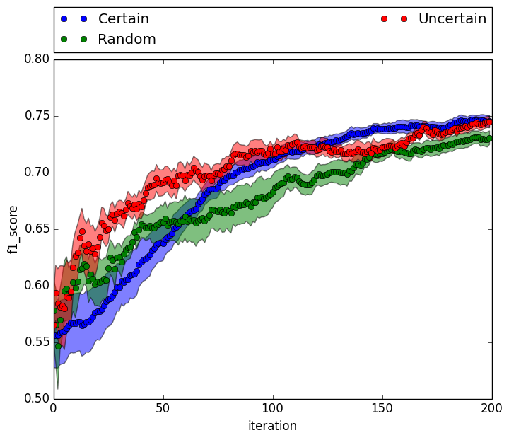
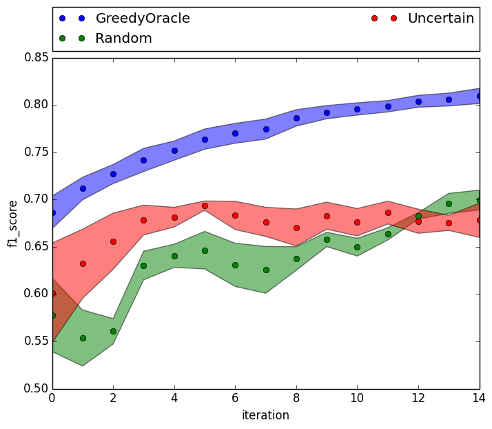
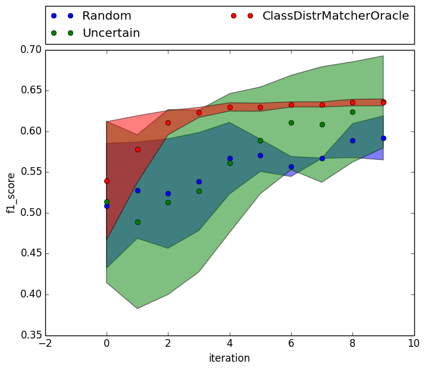
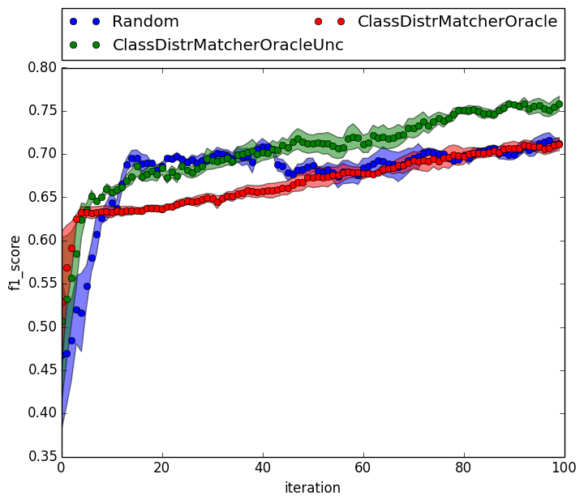

### Experimental Log ###

#### Importing data ###

`make_data.py` contains routines for importing various data sources. E.g., to create and pickle 20 newsgroup data:

	python -m active-prior.make_data --name news --output /data/active-prior/news.pkl
	2013-11-06 10:38:11-root-INFO: Namespace(name='news', output='/data/active-prior/news.pkl')
	2013-11-06 10:38:15-root-INFO: saving news data with 1177 training and 784 testing instances and 2 labels

Similarly for digits data:

	python -m active-prior.make_data --name digits --output /data/active-prior/digits.pkl
	2013-11-06 10:38:55-root-INFO: Namespace(name='digits', output='/data/active-prior/digits.pkl')
	2013-11-06 10:38:55-root-INFO: saving digits data with 200 training and 160 testing instances and 2 labels

#### Baselines ####

We can run the default experiment to compare various active learning algorithms on the 20 newsgroup data:

	python -m active-prior.expt --batch-size 1 --data /data/active-prior/news.pkl --eval f1_score --init-labeled 20 --iters 200 --models Random,Uncertain,Certain --trials 10 --figure expts/baseline.png

This compares random sampling, uncertainty sampling, and certainty sampling
(the latter is not a common strategy, but we include it for comparison). This
results in:

We also add an oracle baseline that does the following to score each candidate
instance to label:

- Add the instance to the training set.
- Retrain the classifier.
- Classify the testing data.
- Compute the roc\_auc\_score on the testing data.

Thus, the score of an instance is the accuracy of the classifier on the
testing data after including that instance in its training set. This is an
upper-bound experiment, though still greedy, since instances are added
incrementally. We call this strategy `GreedyOracle`.

	python -m active-prior.expt --batch-size 1 --data /data/active-prior/news.pkl --eval f1_score --init-labeled 20 --iters 15 --models GreedyOracle,Random,Uncertain --trials 3 --figure expts/greedy_oracle.png

#### Using the Class Distribution to Guide Active Learning ####

Our initial hypothesis is that knowledge of the true class distribution can aid active learning.

Our first oracle experiment selects the next instance to label based on the
following criterion:

- Add the instance to the training set.
- Retrain the classifier.
- Classify the testing data.
- Compare the true class distribution with that predicted by the classifier.
- Compute the average absolute difference of each class proportion.

We call this `ClassDistrMatcherOracle`.

	python -m active-prior.expt --models ClassDistrMatcherOracle,Random,Uncertain,GreedyOracle --iters 100 --trials 3 --init-labeled 20 --figure expts/cdmo.png --eval f1_score

While this approach seems to help in the very beginning, it then does much
worse than random. Looking at the scores for each instance at each iteration,
we see that once the classifier matches the class distribution, it then just
picks instances that don't change the decision boundary much. That is, it pickes
instances that it classifies perfectly (akin to the `Certain` strategy). One
hypothesis is that the algorithm is stuck in a local minimum --- the class
distribution matches perfectly, so the decision boundary doesn't change. But,
while the class distribution matches, the boundary is poor.

To address this, we use a hybrid strategy in which we alternate between using
`ClassDistrMatcherOracle` and `Certain`, which we call
`ClassDistrUncertCombo`. This allows us to inject some randomness to escape
local minima:

	python -m active-prior.expt --models ClassDistrUncertCombo,ClassDistrMatcherOracle,Random,Uncertain,GreedyOracle --iters 100 --trials 3 --init-labeled 20 --figure expt/cdmo_unc.png --eval f1_score

